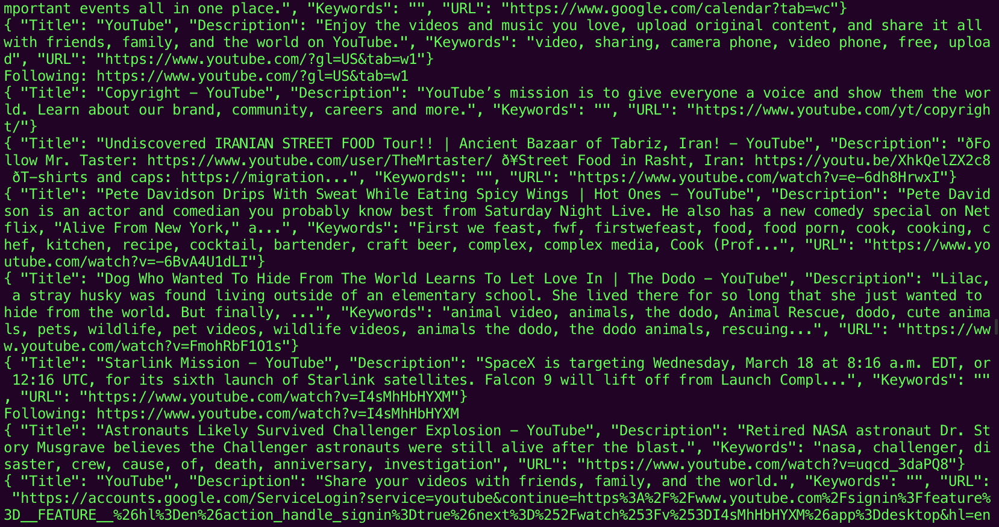

# DFS Web Spider
Figured I'd look into making one.

## Functionality
The web crawler... erm, well... crawls the web.

This is my first go at making one. It uses a randomized DFS (depth-first search) algorithm to ensure a 
diversified crawling pattern, with an adjustable cap to how many sites it can crawl on any given iteration of the DFS. 
It works (mostly) as intended, except with a minor "bug" as detailed below.

## How to use
The script runs on PHP. As such, you will [need to install PHP](https://www.php.net/manual/en/install.php) 
before running the code.

In Terminal (once you are in the directory of this repo):
```shell
php se/index.php
```
runs the code contained in `index.php`. You can interrupt the running code by pressing `Ctrl+C` on macOS.

If you want to write to a JSON file:
```shell
php se/index.php > filename.json
```
Note: You need to manually remove the last comma `,` after the interrupt, then add a closing square bracket `]` 
to the end to have valid JSON.
 
## Changelog
* March 18th, 2020
  * Initial version - v1.0
  * Fully functional with minor bug
  * Planned development of scraping functionality
  * Please help me come up with a more creative name

## Known bugs (no pun intended)
* Spider can get stuck in an infinite loop for pages that redirect to each other, given that the URL is unique 
every time. For example, this can occur when the URL encodes some specific user-related session ID.

## Images

### Crawling in action -- in Terminal


